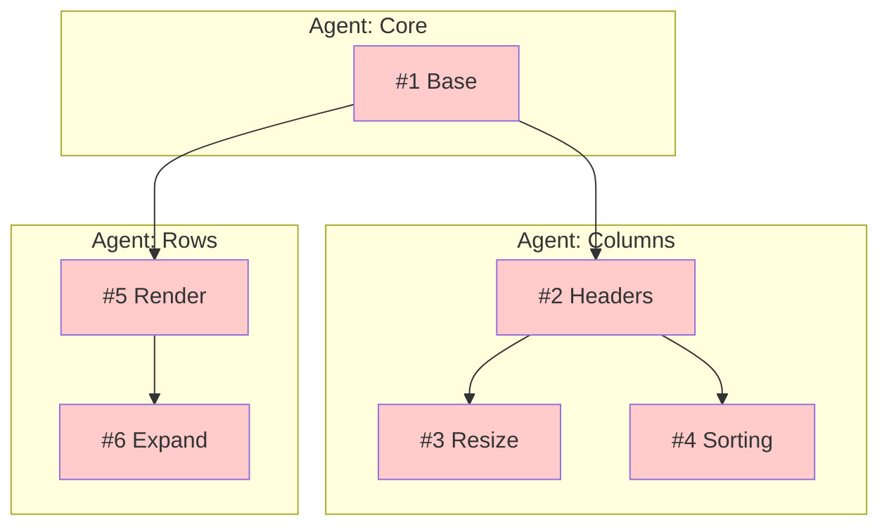

# [Project] [Type] Plan

**Created**: [Date] | **Status**: 0/N complete

## Dependency Graph

## Status

| #   | Feature | Agent   | Status | Blocked By |
| --- | ------- | ------- | ------ | ---------- |
| 1   | Base    | Core    | ❌ GAP | -          |
| 2   | Headers | Columns | ❌ GAP | #1         |
| 3   | Resize  | Columns | ❌ GAP | #2         |
| 4   | Sorting | Columns | ❌ GAP | #2         |
| 5   | Render  | Rows    | ❌ GAP | #1         |
| 6   | Expand  | Rows    | ❌ GAP | #5         |

## Agents

| Agent   | Features   | Owns                      | Depends On    |
| ------- | ---------- | ------------------------- | ------------- |
| Core    | #1         | `src/core/*`              | -             |
| Columns | #2, #3, #4 | `src/components/Column/*` | Core          |
| Rows    | #5, #6     | `src/components/Row/*`    | Core, Columns |

## Files

| Doc                                                  | Purpose                  | Lines  |
| ---------------------------------------------------- | ------------------------ | ------ |
| [plan.md](./plan.md)                                 | Full feature specs       | ~1000  |
| [interfaces.md](./interfaces.md)                     | Contract source of truth | ~300   |
| [gotchas.md](./gotchas.md)                           | Discovered issues        | append |
| [agents/core.agent.md](./agents/core.agent.md)       | Core execution           | ~150   |
| [agents/columns.agent.md](./agents/columns.agent.md) | Columns execution        | ~200   |
| [agents/rows.agent.md](./agents/rows.agent.md)       | Rows execution           | ~180   |

## Quick Start

1. Check status table above
2. Copy appropriate `agents/*.agent.md` to Claude
3. Agent implements per spec
4. Update status when complete
5. Append to `gotchas.md` if issues found

## Legend

| Icon | Status            |
| ---- | ----------------- |
| ❌   | GAP - not started |
| 🔄   | WIP - in progress |
| ✅   | PASS - complete   |
| ⛔   | BLOCKED - waiting |
