# TDD Planning Templates v2.0.0

## Agent Execution File Template

**Target: typically ~200-400 lines. Minimal. Dense. No prose.**

````markdown
# Agent: [Name]

## Scope

Features: #X, #Y, #Z
Own: `src/components/[Area]/*`
Depend on: Agent [N] for #A
Block: Agent [M] waiting on #Y

## Interfaces

### Export (others need these)

```typescript
// #X
export function useThing(id: string): ThingState;
// #Y
export const Component: React.FC<{ id: string; onAction: () => void }>;
```

### Receive (you need these)

```typescript
// #A (Agent N) ✅ READY
import { useContext } from './context';
// Returns: { items: Item[], update: (id, data) => void }

// #B (Agent N) 🔄 WIP - interface locked, impl in progress
import { useOther } from './other';
// Returns: { value: number }
```

## Features

### #X: [Feature Name]

**TL;DR**: [One sentence - when user does A, B happens]

Status: `GAP` | Test IDs: `thing-element-id`, `thing-button-action`

Files:

- `src/components/Thing/useThing.ts` (create)
- `src/components/Thing/useThing.test.ts` (create)

TDD:

1. `returns initial state` → impl hook shell → extract types
2. `updates on action` → add handler → extract to reducer
3. `validates input` → add validation → simplify conditionals

Gotchas:

- Min value 50 or virtualization breaks → clamp in handler

---

### #Y: [Feature Name]

**TL;DR**: [One sentence]

Status: `GAP` | Depends: #X | Test IDs: `component-root`, `component-child-{id}`

Files:

- `src/components/Thing/Component.tsx` (create)
- `src/components/Thing/Component.test.tsx` (create)
- `src/components/Thing/Component.stories.tsx` (create)

TDD:

1. `renders with test id` → basic component → extract props interface
2. `calls onAction when clicked` → add handler → simplify
3. `displays children correctly` → map children → extract child component

Gotchas:

- ResizeObserver no-op in Storybook → trigger manual resize in story

---

## Done Checklist

- [ ] All TDD cycles pass
- [ ] Exports match interface exactly
- [ ] Test IDs implemented
- [ ] Stories build & work
- [ ] Update status → `PASS`
- [ ] `just ci` passes
````

---

## Planning Documents (Verbose)

### README.md Template

````markdown
# [Project] [Type] Plan

**Status**: X/Y features complete
**Agents**: N parallel streams

## Dependency Graph

```mermaid
graph TD
    subgraph A1[Agent 1: Core]
        F1[#1 Base ✅]
    end
    subgraph A2[Agent 2: Columns]
        F2[#2 Headers 🔄]
        F3[#3 Resize ❌]
    end
    subgraph A3[Agent 3: Rows]
        F4[#4 Render 🔄]
        F5[#5 Expand ⛔]
    end
    F1 --> F2
    F1 --> F4
    F2 --> F3
    F4 --> F5
```


````

## Status Matrix

| #   | Feature | Agent | Status     | Blocked By |
| --- | ------- | ----- | ---------- | ---------- |
| 1   | Base    | 1     | ✅ PASS    | -          |
| 2   | Headers | 2     | 🔄 WIP     | -          |
| 3   | Resize  | 2     | ❌ GAP     | -          |
| 4   | Render  | 3     | 🔄 WIP     | -          |
| 5   | Expand  | 3     | ⛔ BLOCKED | #4         |

## Agent Assignments

| Agent | Features | Files Owned     |
| ----- | -------- | --------------- |
| 1     | #1       | `src/core/*`    |
| 2     | #2, #3   | `src/columns/*` |
| 3     | #4, #5   | `src/rows/*`    |

## Files

- [plan.md](./plan.md) - Full feature specs
- [interfaces.md](./interfaces.md) - Contract source of truth
- [gotchas.md](./gotchas.md) - Discovered issues
- [agents/](./agents/) - Execution files

````

---

### plan.md Template (Verbose)

```markdown
# [Project] [Type] - Full Plan

## Overview

[Verbose description of goals, context, approach]

## Feature Specifications

### #1: [Feature Name]

**Area**: [CORE|COLUMNS|ROWS|etc]
**Agent**: 1
**Status**: GAP

#### Behavior (Gherkin)

```gherkin
Feature: [Name]
  Scenario: [Happy path]
    Given [state]
    When [action]
    Then [outcome]
    And [more outcomes]

  Scenario: [Edge case]
    Given [edge state]
    When [action]
    Then [edge handling]

  Scenario: [Error case]
    Given [error condition]
    When [action]
    Then [error handling]
````

#### Interface Contract

```typescript
// Exports
export function useFeature(id: string): {
  value: number;
  setValue: (v: number) => void;
  isValid: boolean;
};

// Constraints:
// - value must be >= 0
// - setValue validates before updating
```

#### Component Design

| Component      | Purpose      | Props                      |
| -------------- | ------------ | -------------------------- |
| `FeatureRoot`  | Container    | `id: string`               |
| `FeatureChild` | Display item | `item: Item, onSelect: fn` |

#### TDD Cycles (Detailed)

**Cycle 1: Basic hook structure**

```typescript
// RED
test('useFeature returns initial value', () => {
  const { result } = renderHook(() => useFeature('test'));
  expect(result.current.value).toBe(0);
});

// GREEN
export function useFeature(id: string) {
  return { value: 0, setValue: () => {}, isValid: true };
}

// REFACTOR
// Extract Value type, add to types/index.ts
```

**Cycle 2: setValue implementation**

[Continue with same detail...]

#### Storybook Stories

| Story     | Purpose        | Props                          |
| --------- | -------------- | ------------------------------ |
| Default   | Standard state | `id: "demo"`                   |
| WithValue | Pre-populated  | `id: "demo", initialValue: 50` |
| Invalid   | Error state    | `id: "demo", initialValue: -1` |

#### Test IDs

| Element        | Test ID               | Purpose             |
| -------------- | --------------------- | ------------------- |
| Root container | `feature-root-{id}`   | Main wrapper        |
| Value display  | `feature-value-{id}`  | Shows current value |
| Action button  | `feature-action-{id}` | Triggers setValue   |

#### Gotchas

**ResizeObserver in Storybook**

Issue: ResizeObserver callback doesn't fire on initial render.
Cause: Storybook's iframe doesn't trigger resize events normally.
Workaround:

```typescript
useEffect(() => {
  window.dispatchEvent(new Event('resize'));
}, []);
```

---

### #2: [Next Feature]

[Same verbose structure...]

````

---

### interfaces.md Template

```markdown
# Interface Contracts

Source of truth for all cross-agent interfaces.

## #1: [Feature Name]

**Agent**: 1 | **Status**: ✅ PASS | **Used by**: #2, #3, #4

```typescript
export interface CoreContext {
  items: Item[];
  selectedId: string | null;
  select: (id: string) => void;
  update: (id: string, data: Partial<Item>) => void;
}

export function useCoreContext(): CoreContext;

// Constraints:
// - items array is never mutated, always replaced
// - select(null) clears selection
// - update merges with existing item data
````

---

## #2: [Feature Name]

**Agent**: 2 | **Status**: 🔄 WIP | **Used by**: #5

```typescript
export function useColumnHeader(id: string): {
  width: number;
  setWidth: (w: number) => void;
  minWidth: number; // Always >= 50
};

// Constraints:
// - setWidth clamps to [minWidth, maxWidth]
// - width changes trigger re-render of dependent components
```

---

````

---

### gotchas.md Template

```markdown
# Discovered Gotchas

Append-only. Add new discoveries at the bottom.

---

## ResizeObserver Storybook

**Found**: [Date] | **Agent**: 1 | **Feature**: #1
**Affects**: Any feature using ResizeObserver

Issue: Callback doesn't fire on initial Storybook render.

Workaround:
```typescript
useEffect(() => window.dispatchEvent(new Event('resize')), []);
````

Fix: TBD - needs Storybook decorator

---

## Minimum Column Width

**Found**: [Date] | **Agent**: 2 | **Feature**: #3
**Affects**: #3, #5

Issue: Width < 50px breaks virtualization.

Workaround:

```typescript
const clamped = Math.max(50, width);
```

Fix: Add validation in Column type

---

```

---

## Test ID Convention

**Format**: `[component]-[element]-[qualifier]`

| Pattern | Example |
|---------|---------|
| By ID | `column-header-name` |
| By index | `row-item-0` |
| By state | `sort-indicator-asc` |
| Combined | `column-resize-name` |

Rules:
- Kebab-case
- Component first
- All interactive elements need IDs
- Tests use `getByTestId()` only

---

## Status Icons

| Status | Icon | Meaning |
|--------|------|---------|
| PASS | ✅ | Complete |
| WIP | 🔄 | In progress |
| GAP | ❌ | Not started |
| BLOCKED | ⛔ | Waiting on dep |
```
