# Plan: AI Control of runi Application via MCP

## Overview

Enable AI/MCP to control the entire runi application through a layered architecture:

```
MCP Server → Rust MCP Adapter → Tauri Channel → Frontend Bridge → Event Bus → UI Components
```

This follows the architectural pattern defined in `.cursorrules` §MCP Integration Patterns: AI/MCP layer emits events to event bus, UI components subscribe and react declaratively.

## Architecture

### Data Flow

```mermaid
graph LR
    MCPServer[MCP Server] -->|MCP Protocol| RustAdapter[Rust MCP Adapter]
    RustAdapter -->|Channel Stream| TauriChannel[Tauri Channel]
    TauriChannel -->|Channel Messages| FrontendBridge[Frontend Bridge Hook]
    FrontendBridge -->|Event Bus Events| EventBus[Event Bus]
    EventBus -->|Subscriptions| UIComponents[UI Components]
    UIComponents -->|State Updates| Stores[Zustand Stores]
```



### Key Components

1. **MCP Adapter (Rust)** - Receives MCP commands, translates to UI commands, streams via Channel
2. **Frontend Bridge** - React hook that listens to Tauri channel, translates to event bus events
3. **UI Command Types** - Declarative command schema that UI components understand
4. **Event Bus Extension** - Add `ai.ui-command` event type for AI-driven actions
5. **Component Subscriptions** - UI components subscribe to `ai.ui-command` events

## Implementation Tasks

### Phase 1: Event Bus Extension

**File:** `src/events/bus.ts`

- Add `'ai.ui-command'` to `EventType` union
- Define `UiCommand` interface with declarative command types
- Document command payload structure

**Command Types:**

- `move-sidebar` - Change sidebar position (left/right)
- `toggle-sidebar` - Toggle sidebar visibility
- `set-sidebar-width` - Resize sidebar (256-500px)
- `toggle-panel` - Toggle DevTools panel visibility
- `set-panel-position` - Dock panel (bottom/left/right/floating)
- `set-panel-size` - Resize panel
- `set-view-mode` - Switch view mode (builder/history)
- `highlight-element` - Visual highlight for UI element
- `execute-command` - Execute command registry command
- `focus-element` - Focus a specific UI element
- `scroll-to` - Scroll to element or position

### Phase 2: UI Command Type Definitions

**File:** `src/types/ui-commands.ts` (new)

Define TypeScript interfaces for all UI commands:

```typescript
export type UiCommandType =
  | 'move-sidebar'
  | 'toggle-sidebar'
  | 'set-sidebar-width'
  | 'toggle-panel'
  | 'set-panel-position'
  | 'set-panel-size'
  | 'set-view-mode'
  | 'highlight-element'
  | 'execute-command'
  | 'focus-element'
  | 'scroll-to';

export interface BaseUiCommand {
  type: UiCommandType;
  timestamp?: number;
}

export interface MoveSidebarCommand extends BaseUiCommand {
  type: 'move-sidebar';
  position: 'left' | 'right';
}

// ... other command interfaces
```

### Phase 3: Rust MCP Adapter

**Files:**

- `src-tauri/src/infrastructure/mcp/adapter.rs` (new)
- `src-tauri/src/infrastructure/mcp/commands.rs` (new)
- `src-tauri/src/infrastructure/mcp/mod.rs` (new)

**Implementation:**

1. Add MCP dependencies to `Cargo.toml`:
   - `mcp` crate (or equivalent Rust MCP implementation)
   - Ensure async/tokio compatibility

2. Create MCP adapter that:
   - Connects to MCP server (stdio or HTTP transport)
   - Receives MCP tool calls / commands
   - Translates MCP commands to `UiCommand` enum
   - Streams commands via Tauri `Channel<UiCommand>`

3. Define Rust `UiCommand` enum matching TypeScript types (serializable via serde)

4. Tauri command to initialize MCP connection:
   ```rust
   #[tauri::command]
   pub async fn initialize_mcp_adapter(
       app: AppHandle,
       on_command: Channel<UiCommand>
   ) -> Result<(), String>
   ```

### Phase 4: Frontend MCP Bridge

**File:** `src/hooks/useMcpAdapter.ts` (new)

React hook that:

- Initializes MCP adapter via Tauri command (passes Channel)
- Listens to channel messages
- Translates channel messages to event bus `ai.ui-command` events
- Handles cleanup on unmount

**File:** `src/hooks/useUiCommands.ts` (new)

Optional hook for components to easily subscribe to UI commands:

- Wraps event bus subscription to `ai.ui-command`
- Filters commands by type if needed
- Provides convenient API for components

### Phase 5: Component Integration

**Files to update:**

1. **MainLayout.tsx** - Subscribe to sidebar/panel commands
   - Listen for `move-sidebar`, `toggle-sidebar`, `set-sidebar-width`
   - Listen for `toggle-panel`, `set-panel-position`, `set-panel-size`
   - Call store actions based on command payload

2. **Sidebar.tsx** - Subscribe to sidebar-specific commands
   - Listen for sidebar visibility/position commands
   - Update internal state via `useSettingsStore`

3. **DockablePanel.tsx** - Subscribe to panel commands
   - Listen for panel position/size/visibility commands
   - Update via `usePanelStore`

4. **RequestBuilder.tsx** - Subscribe to request-focused commands
   - Listen for `focus-element`, `highlight-element`
   - Listen for `execute-command` (e.g., send request)

5. **App.tsx** or **routes/index.tsx** - Initialize MCP adapter
   - Call `useMcpAdapter()` hook at app root
   - Ensure MCP adapter is initialized once

### Phase 6: Command Registry Integration

**File:** `src/commands/registry.ts`

- Ensure command registry can be called programmatically
- Add helper to execute commands from `execute-command` UI command
- Map command IDs to handlers (e.g., `'request.send'` → send HTTP request)

### Phase 7: Testing

**Test Files:**

1. **Frontend Tests:**
   - `src/events/bus.test.ts` - Test `ai.ui-command` event emission/handling
   - `src/hooks/useMcpAdapter.test.ts` - Test MCP adapter hook
   - `src/hooks/useUiCommands.test.ts` - Test UI commands hook
   - `src/types/ui-commands.test.ts` - Validate command type definitions

2. **Rust Tests:**
   - `src-tauri/src/infrastructure/mcp/adapter_test.rs` - Test MCP adapter
   - `src-tauri/src/infrastructure/mcp/commands_test.rs` - Test command translation

3. **Integration Tests:**
   - End-to-end test: MCP server → Rust → Frontend → UI update
   - Mock MCP server for testing
   - Verify event bus integration

## Technical Details

### Tauri Channel Usage

Following [Tauri channels documentation](https://tauri.app/develop/calling-frontend/#channels):

**Rust Side:**

```rust
use tauri::ipc::Channel;

#[derive(Clone, Serialize)]
#[serde(rename_all = "camelCase", tag = "type")]
enum UiCommand {
    MoveSidebar { position: String },
    ToggleSidebar,
    // ... other variants
}

#[tauri::command]
async fn initialize_mcp(
    app: AppHandle,
    on_command: Channel<UiCommand>
) -> Result<(), String> {
    // Stream commands via channel
    on_command.send(UiCommand::ToggleSidebar).unwrap();
    Ok(())
}
```

**Frontend Side:**

```typescript
import { invoke, Channel } from '@tauri-apps/api/core';

const onCommand = new Channel<UiCommand>();
onCommand.onmessage = (command) => {
  globalEventBus.emit('ai.ui-command', command);
};

await invoke('initialize_mcp', { onCommand });
```

### Command Translation Pattern

MCP commands → Declarative UI commands:

```
MCP Tool Call: "move_sidebar" with args {position: "right"}
    ↓
Rust: UiCommand::MoveSidebar { position: "right" }
    ↓
Channel: Stream to frontend
    ↓
Frontend: Emit event bus 'ai.ui-command'
    ↓
Component: Subscribe, call useSettingsStore().setSidebarPosition('right')
```

### Error Handling

- MCP connection failures → Log error, disable AI features gracefully
- Invalid commands → Log warning, ignore command
- Channel errors → Retry or degrade to event-only fallback
- Component errors → Catch in event handler, log, continue

### State Management

All UI state remains in Zustand stores:

- `useSettingsStore` - Sidebar visibility, view mode
- `usePanelStore` - Panel position, size, visibility

UI commands trigger store actions, maintaining unidirectional data flow.

## Dependencies

### Rust (`Cargo.toml`)

```toml
[dependencies]
# MCP support (TBD: find correct Rust MCP crate)
# mcp = "0.1"  # or equivalent

# Existing
tauri = { version = "2.9", features = ["ipc"] }
serde = { version = "1", features = ["derive"] }
tokio = { version = "1", features = ["full"] }
```

### Frontend (`package.json`)

No new dependencies required - uses existing:

- `@tauri-apps/api/core` (for Channel)
- Event bus (already implemented)
- Zustand stores (already implemented)

## Migration Path

1. **Phase 1-2** - Event bus and types (non-breaking)
2. **Phase 3-4** - Rust adapter and frontend bridge (feature flag)
3. **Phase 5** - Component integration (gradual, components work without MCP)
4. **Phase 6-7** - Registry integration and testing

Each phase can be merged independently. MCP features are opt-in and don't break existing functionality.

## Success Criteria

- AI can control all major UI elements (sidebar, panels, view modes)
- Commands flow: MCP → Rust → Channel → Event Bus → UI
- All commands are declarative and type-safe
- Components remain testable (mock event bus)
- No breaking changes to existing functionality
- Full test coverage for MCP integration

## Open Questions

1. **MCP Rust Crate** - Which Rust crate should we use for MCP protocol? (Need to research current options)
2. **MCP Server Location** - Where does MCP server run? (Separate process? Embedded? HTTP/stdio transport?)
3. **Command Scope** - Which commands should be exposed initially? (Start with layout, expand to request/response)
4. **Security** - How to validate/authorize MCP commands? (Sandboxing? Permission model?)
5. **Error Recovery** - How to handle MCP connection drops? (Reconnect strategy? Fallback behavior?)

## References

- [Tauri Channels Documentation](https://tauri.app/develop/calling-frontend/#channels)
- `.cursorrules` §MCP Integration Patterns
- `.planning-docs/addendums/003-enterprise-mcp-strategy.md`
- `.planning-docs/addendums/001-ai-architecture.md`
- `src/events/bus.ts` - Event bus implementation
- `src/stores/useSettingsStore.ts` - Settings store
- `src/stores/usePanelStore.ts` - Panel store
