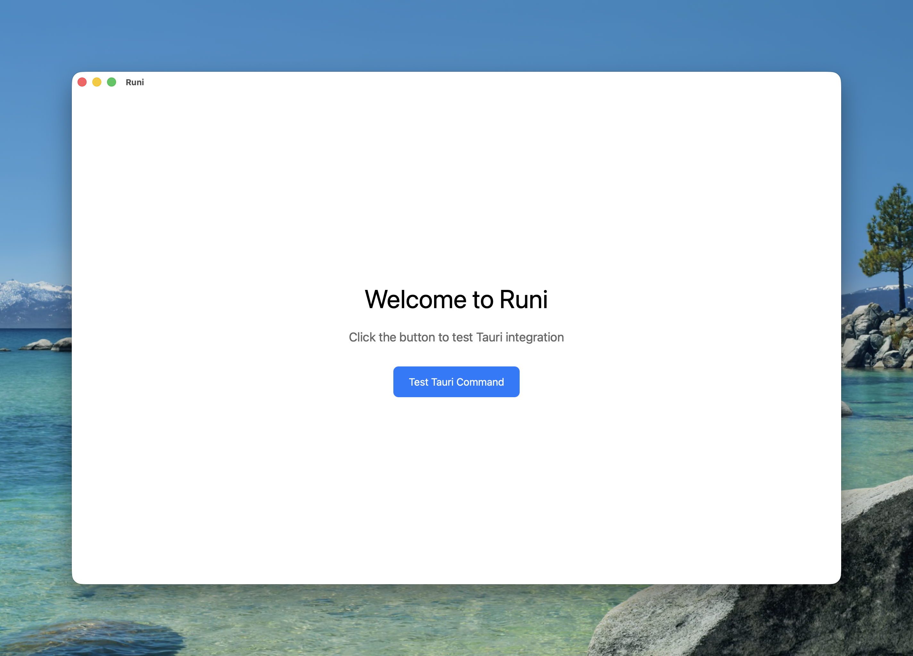

# Runi

[](https://github.com/paulbreuler/runi/actions/workflows/ci.yml)
[](https://opensource.org/licenses/MIT)

An open-source API design, exploration, and testing tool for macOS and Linux.



## About This Project

**This is a vibe coding experiment.**

Runi is being built from an empty repo using AI-assisted development (primarily Claude) with human oversight. The goal is to explore what emerges when someone with production engineering experience pushes AI-assisted coding to its limits—and to document the real outputs, costs, and limitations along the way.

This project serves two purposes:

1. **A functional tool**: API request chaining, visualization, auth handling, testing, and security probing
2. **A transparent experiment**: Demonstrating what vibe coding actually produces versus the hype

Every PR, every session metric, every bug fix is public. Come watch, contribute, or call bullshit when you see it.

## Tech Stack

- **Frontend**: Svelte 5 with SvelteKit 2
- **Backend**: Rust with Tauri 2
- **Styling**: Tailwind CSS v4 with shadcn-svelte
- **Platforms**: macOS and Linux

## Architecture

The project follows clean architecture principles:

### Rust Backend (`src-tauri/`)

- **Domain Layer** (`src/domain/`): Core business logic and models
- **Application Layer** (`src/application/`): Services and use cases
- **Infrastructure Layer** (`src/infrastructure/`): External interfaces (Tauri commands, networking)

### Svelte Frontend (`src/`)

- **Routes** (`src/routes/`): Pages and routing
- **Components** (`src/lib/components/`): Reusable UI components
- **Stores** (`src/lib/stores/`): State management using Svelte runes
- **Utils** (`src/lib/utils/`): Helper functions

## Getting Started

### Prerequisites

- Node.js 18+ and npm
- Rust toolchain (install from [rustup.rs](https://rustup.rs/))

### Installation

```bash
npm install
```

### Development

```bash
npm run tauri dev
```

This starts the SvelteKit dev server on `http://localhost:5173` and launches the Tauri application.

### Production Build

```bash
npm run build
npm run tauri build
```

The built application will be in `src-tauri/target/release/bundle/`.

## Testing

Run Rust tests:

```bash
cd src-tauri
cargo test
```

Run frontend tests:

```bash
npm test
```

## Contributing

Contributions are welcome! This is an experiment in public, so:

- Open issues for bugs, ideas, or questions
- PRs are appreciated—just know the codebase is evolving rapidly
- If you spot AI-generated nonsense that slipped through review, please call it out

## License

MIT License - see [LICENSE](LICENSE) for details.

Copyright (c) 2026 Paul Breuler
